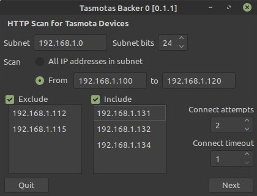

# tasmotasbacker0 : Tasmotas Backer 0

**Version 0.1.2** (July 10, 2021)

A utility that can back up the configuration of all Tasmota devices on a network. Contrary to [tasmotasbacker](https://github.com/sigmdel/tasmotasbacker), it does not use an MQTT broker to obtain the IP addresses of the Tasmota devices nor does it require any external libraries.



As shown, the utility will scan all IP addresses in the range 192.168.1.100 to 192.168.1.120 skipping two addresses, 192.168.1.112 and 192.168.1.115 and then scan an additional three addresses 192.168.1.131, 192.168.1.132 and 192.168.1.134 looking for Tasmota devices.

<!-- TOC -->

- [1. Requirements](#1-requirements)
- [2. Compiling](#2-compiling)
- [3. Testing](#3-testing)
- [4. Installation and Releases](#4-installation-and-releases)
- [5. Program Options](#5-program-options)
- [6. Usage](#6-usage)
- [7. Timing](#7-timing)
- [8. Similar Projects](#8-similar-projects)
- [9. Acknowledgment](#9-acknowledgment)
- [10. Licence](#10-licence)

<!-- /TOC -->

## 1. Requirements

There are no specific requirements, but the [Free Pascal](https://www.freepascal.org/) / [Lazarus](https://www.lazarus-ide.org/) development environment is required in order to compile the program.

## 2. Compiling

The repository is self-contained, so creating this tool should be straightforward. Clone the repository, start the Lazarus IDE, load the project, `tasmotasbacker0.lpi` and compile. 

When compiling a final version, it would be advisable to heed the following advice.

1. Ensure that the directive `INCLUDE_HTTP_OPTIONS` is added in the `Personalised Options` in `Project Options /Compiler Options`.

2. The application icon should be defined, but if it is not then select `Load Icon` in `Project / Project / Project Options` in the Lazarus IDE. The `tasmotabacker.png` image in the `images` directory can be used but it is the same one used for the MQTT based version of the utility ([tasmotasbacker](https://github.com/sigmdel/tasmotasbacker)) .

3.  Compile the release version. Select the `Release` build mode in `Project / Project Options / Compiler Options` in the Lazarus IDE. This will reduce the size of the executable by an order of magnitude.

## 3. Testing

The project was built with Lazarus 2.0.12 (Free Pascall 3.2.0) on a Mint 20.1 system. A cursory test was done with the same compiler in Windows 10.

## 4. Installation and Releases

The file `tasmotasbacker0-r****.gz`, contains a compressed `x86_64-linux` binary which was tested on Mint 20.1 . Extract the binary `tasmotasbacker0` to a directory in the search path such as `~./local/bin/`.  Copy the image `images/tasmotabacker.png` into the same directory. The `installation` directory contains a `tamostasbacker0.desktop` file along with rudimentary instructions on how to install the utility in a Mint 20.1 Mate system. Presumably, installation in other Linux distributions would be more or less the same.

Details about installation of an application in Windows are unfortunately not provided. A `x86_64-win64` binary is provided in the `tasmotasbacker0-r****.zip` archive.


## 5. Program Options

In Linux, the program parameters are saved in the `ini` configuration file named  `~/.config/sigmdel/tasmotabacker0/options.ini` where `~` is the user home directory. So the fully expanded file name is
<pre> /home/&lt;<i>user</i>&gt;/.config/sigmdel/tasmotasbacker0/options.ini</pre>

In Windows 10, the file is saved in the local `AppData` folder :
<pre>  C:\Users\&lt;<i>user</i>&gt;\AppData\Local\sigmdel\tasmotasbacker0\options.ini</pre>

## 6. Usage

Information on how to use the program can be found on this site: [DIY Tasmota Backups](https://sigmdel.ca/michel/ha/tasmota/tasmota_backups_en.html).


## 7. Timing

Because the HTTP requests sent by the utility are blocking, timeouts have to be specified otherwise the program could hang. There are four options that can be tweaked:

IP Scanning timing

1. `Connect attempts` - the maximum number of times an HTTP request for the hostname is sent to an IP address to establish if it is a Tasmota device.

2. `Connect timeout` - the maximum time to wait for a reply. Specified in seconds, the minimum is 1 second.

Configuration download timing

3. `Download attempts` - the maximum number of times an HTTP request for the Tasmota configuration is made.

4. `Download timeout` -  the maximum time to wait for a reply. Specified in seconds, the minimum is 1 second.

The default values usually work well on a system with a 4th generation i7 CPU running Linux Mint 20.1. However both timeout values had to be increased to 4 or even 6 seconds on a system with a 4th generation i5 running Windows 10 connected to the same local area network. 

Mileage will vary as the per the old chestnut. To help find reasonable values, there are four directives in the `main0.pas` unit (named `DEBUG_HTTP_REQUEST`, `DEBUG_BACKUP`, `DEBUG_HTTP_SCAN` and `DEBUG_TIME_HTTP`) that can be defined to log some timing information. To see the time log in Linux, start the application from a terminal. In Windows, the log is saved to a file named `tasmotasbacker0.log` in the same directory as the executable when the latter is exited. Here is part of the timing log when `DEBUG_HTTP_REQUEST` is defined.

```
              time    diff   message
11:56:34.132856187       0   HttpRequest(url: http://192.168.1.100/cm?cmnd=hostname, maxtries: 2, timeout: 4000)
11:56:34.132856218      31     request returns after 1 tries with code = 200, data = <!DOCTYPE html>?<html>?<head>? <meta http-equiv="Content-Type" c
11:56:34.132856234       0   HttpRequest(url: http://192.168.1.101/cm?cmnd=hostname, maxtries: 2, timeout: 4000)
11:56:34.132856500     266     Exception class EHTTPClient, message Unexpected response status code: 404, code 404, try 1
11:56:34.132856500       0     request returns after 1 tries with code = 404, data = 
11:56:34.132856515       0   HttpRequest(url: http://192.168.1.102/cm?cmnd=hostname, maxtries: 2, timeout: 4000)
11:56:35.132856765     250     request returns after 1 tries with code = 200, data = {"Hostname":"entree"}
11:56:35.132856765       0   HttpRequest(url: http://192.168.1.102/cm?cmnd=topic, maxtries: 2, timeout: 4000)
11:56:35.132856890     125     request returns after 1 tries with code = 200, data = {"Topic":"entree"}
11:56:35.132856921       0   HttpRequest(url: http://192.168.1.103/cm?cmnd=hostname, maxtries: 2, timeout: 4000)
11:56:35.132857375     454     request returns after 1 tries with code = 200, data = {"Hostname":"lampe-biblio"}
11:56:35.132857375       0   HttpRequest(url: http://192.168.0.103/cm?cmnd=topic, maxtries: 2, timeout: 4000)
11:56:35.132857500     125     request returns after 1 tries with code = 200, data = {"Topic":"lampe-biblio"}
...
11:56:35.132857531       0   HttpRequest(url: http://192.168.1.155/cm?cmnd=hostname, maxtries: 2, timeout: 4000)
11:56:39.132861546    4015     Exception class ESocketError, message Connection to 192.168.1.155:80 timed out., code 5, try 1
11:56:39.132861546       0     http request attemp 1 failed with code: 5
11:56:47.132869578    8032     Exception class ESocketError, message Connection to 192.168.1.155:80 timed out., code 5, try 2
11:56:47.132869578       0     http request attemp 2 failed with code: 5
...
```
The fractional part of the seconds entry in the time stamp is the system tick count. The diff column shows the number of tick counts between two entries in the log which is nominally the number of elapsed milliseconds between them. Since this tick counter is reset to 0 for each new HTTP request it is easy to see the time taken by the device to reply.  

## 8. Similar Projects

A version of this project that used an MQTT broker to find Tasmota devices is available.

- [tasmotasbacker](https://github.com/sigmdel/tasmotasbacker) by sigmdel.

It does require the `mosquitto` library which may be difficult to install on some systems. The scan to find devices can be considerable shorter when ising an MQTT broker. On the other hand, Tasmota devices that are not configured to use an MQTT broker or that have a broken MQTT configuration will not be found.

There are two Python scripts on GitHub that do essentially the same thing:

- [tas-backup](https://github.com/dragonflyuk) by dragonflyuk,
- [Tasmota-Config-Backup](https://github.com/rt400/Tasmota-Config-Backup/blob/master/tasmota_backup.py) by Yuval (rt400).

There is also a much more ambitious PHP/Sqlite project:

- [TasmoBackupV1](https://github.com/danmed/TasmoBackupV1) by danmed.

A thorough search would probably turn up many more references.

## 9. Acknowledgment

Obviously, this utility would not have been possible without the [Free Pascal](https://www.freepascal.org/) and the [Lazarus Ide](https://www.lazarus-ide.org/) projects.

Useful information was obtained from others. Where possible, acknowledgment and references are provided in the source code.

## 10. Licence

The **BSD Zero Clause** ([SPDX](https://spdx.dev/): [0BSD](https://spdx.org/licenses/0BSD.html)) licence applies to the original code in this repository.
